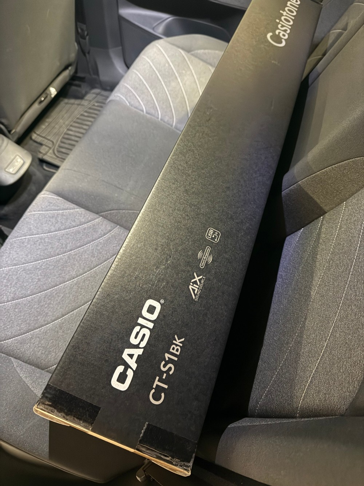

I love Deltarune and Undertale's soundtracks and listen to them constantly. Today, I've decided that I'm going to learn the piano such that I can play at least two Deltarune songs by the end of 2026, despite having no previous piano experience.

Two years ago, I wasn't able to run for a few minutes without gasping for breath. Two years later, I ran multiple half-marathons and had a 5k personal best clocking at under 5:00/km (which is fast!) -- I think I can do the same with the piano, despite my fear of failure.

This is a very scary and daunting challenge. I have absolutely no idea if I will succeed. Learning to play the piano without any prior experience as an adult is challenging, and I sincerely hope that I will develop the skill and maintain the discipline necessary to succeed. I have only myself to blame if I fail. It's time to learn the piano!

This blog is to document my progress day by day so that I stay motivated and accountable. If I slack off, I will shame myself in front of the entire world!

## Getting a beginner's piano

Today is day 1: I just drove to Paris to buy my piano, a Casio CT-S1, which I chose based on reviews saying that it's a great beginner's piano, and also due to its small size and affordable price.

I can't drive back home just yet to set it up, because I have some meetings first which I must attend to.

## Which songs?

[This video seems useful for sampling a bunch of songs and getting a feel for them](https://youtu.be/ijW-P4G5Ok4). In addition, I'd like to try to learn how to play:

- [_The Legend_](https://www.youtube.com/watch?v=tUBxb8GU7Xc)
- [_Don't Forget_](https://www.youtube.com/watch?v=QDOKK-Nny2M)

I chose the above songs not because they're my ideal Deltarune songs, but because they seem easy. Ideally, I'd like to play _Scarlet Forest_, _Ruder Buster_ and other songs, but they seem out of reach. Even those easy ones above seem out of reach!

---

I'll post my first piano-playing update tomorrow, by which time I'll have used it for the first time.
