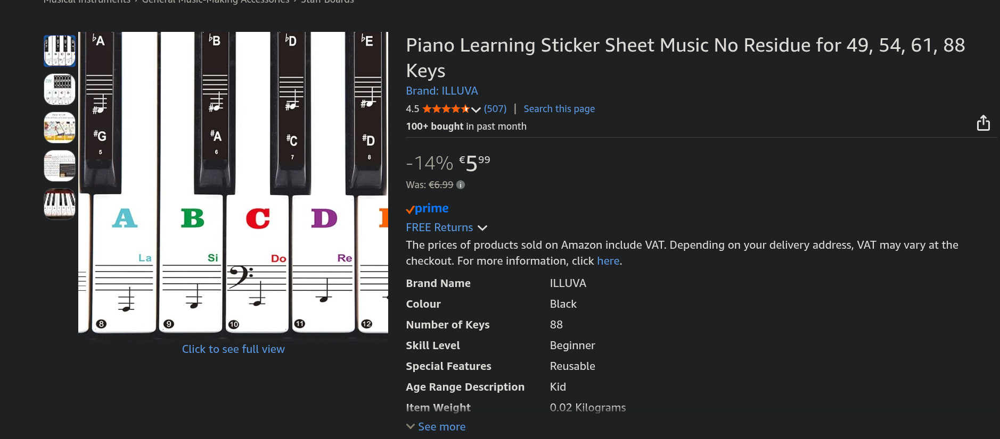

Last night, I set up my piano on my desk and played it a little bit. But the real work started today: I did about an hour and a half in the morning, followed by an hour in the evening.

After getting a feel for the machine, the first thing I tried to do was play [_The Legend_](https://www.youtube.com/watch?v=tUBxb8GU7Xc) and now today by the end of Day 2, it remains the main song that I've been trying to play.

Playing the actual song itself "the stupid way" (memorizing the keys to press and pressing them) isn't hard. If I just stick to it for a couple of weeks, I can seem like I "mastered" the above song.

What's really challenging to me right now is understanding the where the damn notes are! Indeed, I immediately realized that it was strange how pianos ship without the names of the notes written on them, same as we write the letters on computer keyboards:

<blockquote class="bluesky-embed" data-bluesky-uri="at://did:plc:zpu3zbbixhvl5uvcfq2tlci6/app.bsky.feed.post/3mckxxdt5hc2p" data-bluesky-cid="bafyreidguq4wge6i4qrjrrs6m4oqlgkovn3duwfbifilz6ltyl5i3ixfam" data-bluesky-embed-color-mode="system">
EXCUSE ME, INVENTOR OF THE PIANO? WHY DON&#x27;T YOU WRITE THE NAME OF THE NOTE ON THE PIANO KEYS, PLEASE? WHEN SOMEONE IS LEARNING HOW TO USE THE COMPUTER, YOU DON&#x27;T GIVE THEM A KEYBOARD WITH NO LETTERS ON THE KEYBOARD. PLEASE WRITE WHERE IS C# AND B2 ETC. THANK YOU FOR YOUR ATTENTION TO THIS MATTER
&mdash; Nadim Kobeissi (<a href="https://bsky.app/profile/did:plc:zpu3zbbixhvl5uvcfq2tlci6?ref_src=embed">@nadim.computer</a>) <a href="https://bsky.app/profile/did:plc:zpu3zbbixhvl5uvcfq2tlci6/post/3mckxxdt5hc2p?ref_src=embed">January 16, 2026 at 9:49 PM</a></blockquote>

I quickly placed an order for the following set on stickers on Amazon:

In the meantime, my piano looks like this:

The red stickers indicate C notes, and the blue stickers indicate A notes. [This video](https://www.youtube.com/watch?v=4SXQ_wlbWog) taught me how to place my hands and gives a few pointers for memorizing where the notes are, but I still need a lot of practice to be able to find the notes via muscle memory, same as when I type on a keyboard.

Apparently, pianists memorize the notes by muscle memory, same as I suppose I have QWERTY keyboards memorized (I can type at 120+wpm without effort.) I wonder how I'll get there with the piano...

I'm looking for a set of structured lessons to follow and have heard good things about [_Alfred's Basic Adult All-in-One Course, Book 1_](https://www.alfred.com/alfreds-basic-adult-all-in-one-course-book-1/p/00-5753/), so I think I'll start with it tomorrow.

Overall, the amount of resources available for learning the piano seem abundant, so this really seems like a question of dedication and seriousness.

This is all for Day 2.
