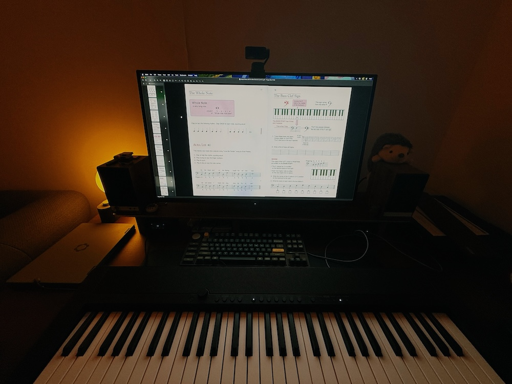

Today, did roughly 2 hours of piano:

1. Lots of drills on correct hand positioning, memorizing notes.
2. Removed the silly stickers indicating positions of C and A keys.
3. Lots of practice playing _The Legend_, _Ode to Joy_, the Freedom Motif from _The World Revolving_...

Essentially, I got to page 25 in _Alfred's Basic Adult All-in-One Course, Book 1_:

I also got in touch with a piano teacher with whom I might start taking lessons soon. His first request: stick to the book so that I avoid learning bad habits, and also, get a piano pedal before any eventual lessons with him. So I ordered [this one](https://www.amazon.fr/-/en/Yamaha-Digital-Piano-Pedal-Silver/dp/B00A3IJWYE/?th=1).

I am going to doggedly power through this. I will not give up. I will practice every single day, and by the end of this year, I will achieve a humble standard of competence at the piano.
