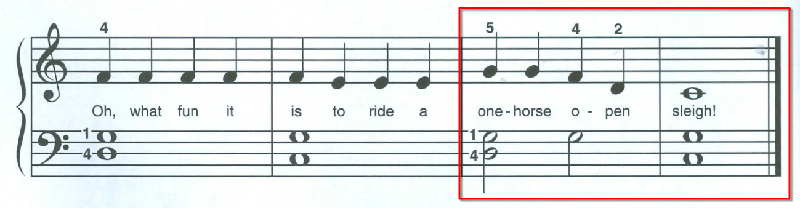

Meet my greatest opponent, _"Jingle Bells"_:

Of course this is a very easy piece, but I found it challenging not because it's a difficult melody but because it forced me to both, at the same time:

- Get better at reading notes,
- Get better at playing with both hands.

~~Open question to mankind: why are the notes on the bass staff written differently than on the treble staff?! On the treble staff, the C is all the way at the bottom. On the bass staff, it's somewhere near the middle?! Why???~~ It's because it makes the notes on both staves equidistant from middle C.

Then, after _Jingle Bells_, there's _Brother John_:

Same story except this time they don't even show me the starting note on the treble staff. Too bad, Nadim's brain! Better get used to it!

You'll notice that in both the treble and bass staffs in _Brother John_, there's a lightning-shaped squiggly line. This means "rest for one count" (out of four). Then, the little hockey puck means "half rest", which is "resting for two counts". Why not just not put any notes at all?! Instead of the strange arbitrary shapes?? But what do I know.

So, today's goal has been to keep repeating these two pieces until they're effortless, with both hands playing together.

Also, during today's lunch break, I watched a bunch of videos from [Jazer Lee](https://www.youtube.com/@jazerleepiano)'s YouTube channel. He seems really good, and his videos are giving me a lot of insight on random things about playing the piano.

Anyway, back to Jingle ~~Hell~~ Bells.

---

**End of day update**: practiced some more. I can now get both songs right. _Brother John_ turned out to be trivial compared to _Jingle Bells_ and didn't teach me anything new. _Jingle Bells_ was a big challenge and I found it difficult! Largely because of the whole thing where you're learning how to play with both hands while reading notes.

The very last five notes are the most challenging...

...largely because you need to switch your bass fingers after only two counts, and then again at the next segment, so three times in total.

Whew! Piano is hard. But I won't give up!!! I'm going to learn the piano and play Toby Fox songs!
