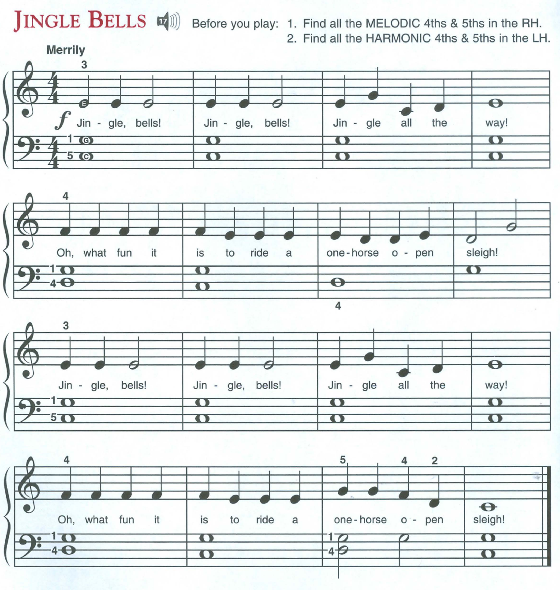
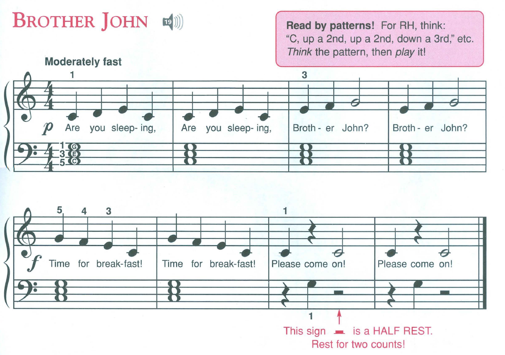

Meet my greatest opponent, _"Jingle Bells"_:

Of course this is a very easy piece, but I found it challenging not because it's a difficult melody but because it forced me to both, at the same time:

- Get better at reading notes,
- Get better at playing with both hands.

Open question to mankind: why are the notes on the bass staff written differently than on the treble staff?! On the treble staff, the C is all the way at the bottom. On the bass staff, it's somewhere near the middle?! Why???

Then, after _Jingle Bells_, there's _Brother John_:

Same story except this time they don't even show me the starting note on the treble staff. Too bad, Nadim's brain! Better get used to it!

So, today's goal has been to keep repeating these two pieces until they're effortless, with both hands playing together.

Also, during today's lunch break, I watched a bunch of videos from [Jazer Lee](https://www.youtube.com/@jazerleepiano)'s YouTube channel. He seems really good, and his videos are giving me a lot of insight on random things about playing the piano.

Anyway, back to ~~torture~~ Jingle Bells.
