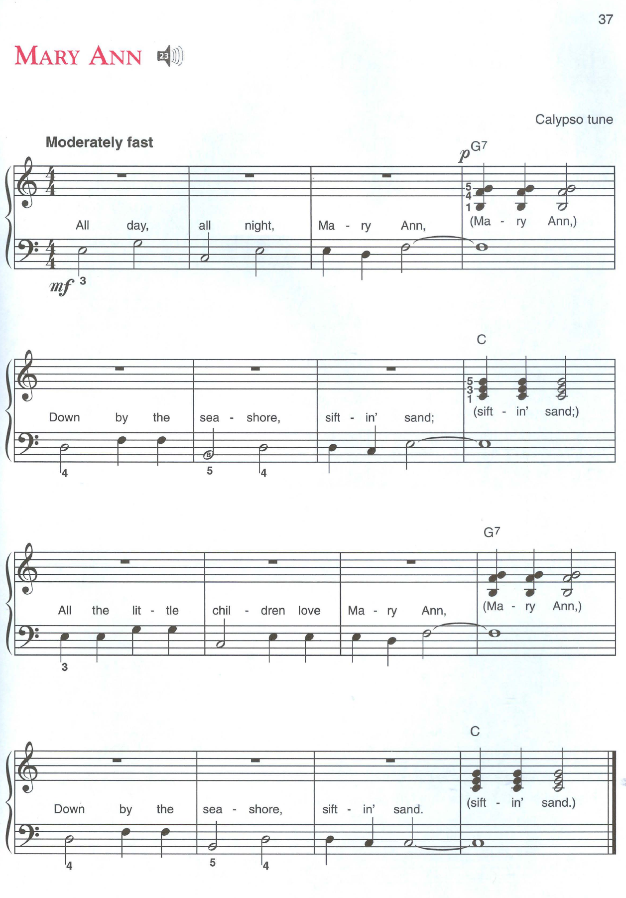
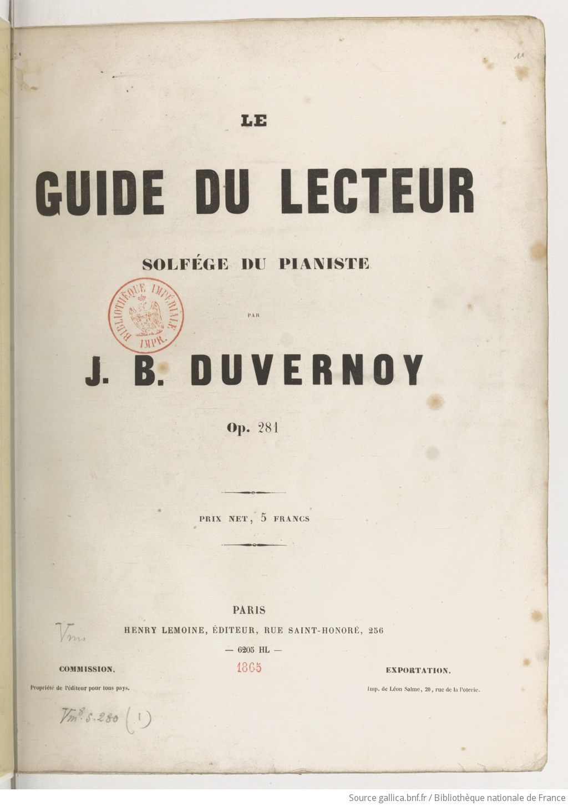
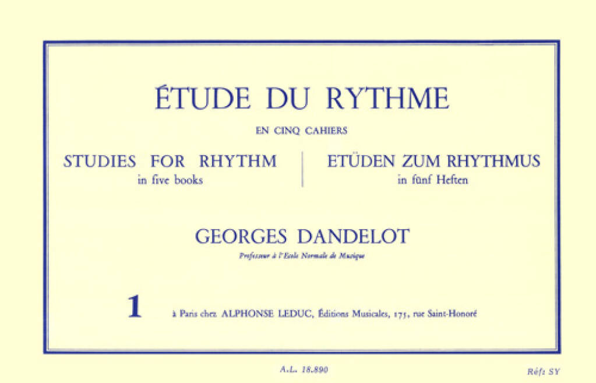
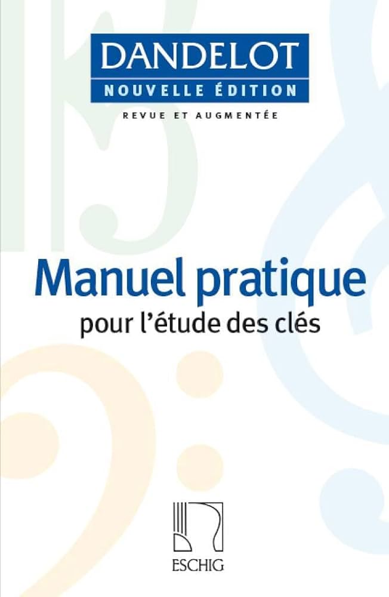

I have conquered _Jingle Bells_...

<audio controls src="jingle-bells.mp3"></audio>

...and have moved on to the next challenge, _Mary Ann_:

_Mary Ann_ requires more nimble and varied use of the left hand for bass clef notes. Essentially this seems to be switching up the use of the left and right hands compared to _Jingle Bells_, while also introducing some new chords and combinations.

---

Also! My first piano lesson with an actual piano teacher is next Monday morning. He seems to be an old-fashioned classical learning style of guy; I say this based on his instructions, which amount to 

> _"Don't adopt bad form or habits by the time we meet! Stick to Alfred's, and bring with you a notebook and these three books:"_ -- Piano teacher

The three books:

Yes, you read that right: the textbook he asked me to buy dates from **1865!** Followed by this equally ancient guide:

The third one seems a bit more modernized, hopefully:

I don't know what to make of this, frankly. I think it's to be expected from Parisian piano teachers. The French style of education tends to be very rigid like this.

Reminds me of my early years in middle school: I was sent to a French school set up in Lebanon after the civil war by the French government, and the teaching there was similarly quite strict (eventually, I was expelled for being "anti-establishment", but I think I'm convinced that rigid instruction is what I need this time, when it comes to the piano, at least.)
